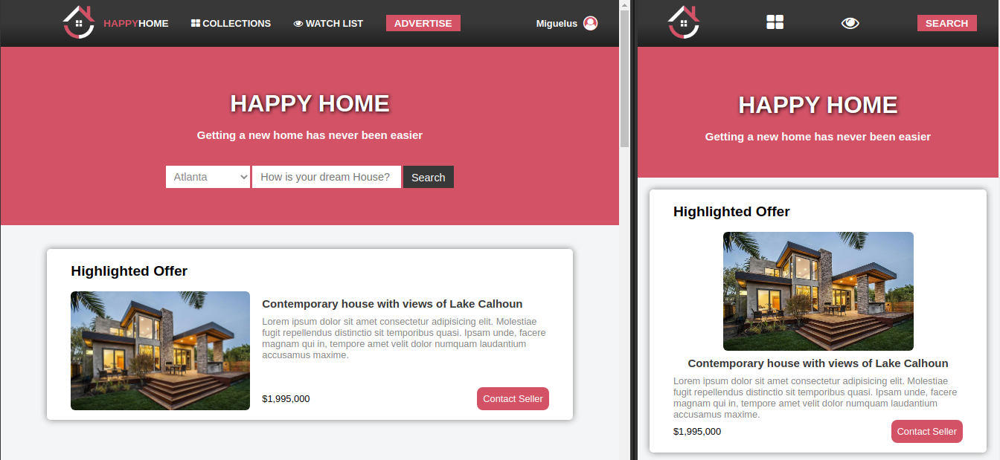

# Happy Home

This is a Real State online shopping page, made as the capstone project for Microverse.

> In this project I used different technologies such as flexbox and grid to position the different elements on the page.
> I also used Media Querys to add responsiveness in three different device sizes.

## Built With

- HTML5,
- CSS3,
- Fontawesome

## Live Demo

[Live Demo Link](https://raw.githack.com/Miguelus373/Capstone-Project/happyhome-page/index.html)

## Getting Started

To get a local copy up and running follow these simple example steps.

- Go to the main page of the repo.
- Press the "Code" button and get the repo link.
- Clone it using git.

## Author

👤 **Miguel Uzcátegui**

- Github: [@miguelus373](https://github.com/miguelus373)
- Linkedin: [Miguel-Uzcátegui](https://www.linkedin.com/in/miguelus/)

## 🤝 Contributing

Contributions, issues and feature requests are welcome!

Feel free to check the [issues page](https://github.com/Miguelus373/Capstone-Project/issues).

## Show your support

Give a ⭐️ if you like this project!

## 📝 License

This project is [MIT](lic.url) licensed.
